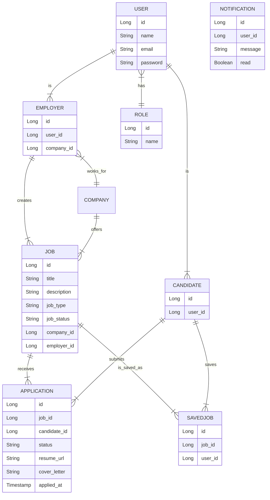
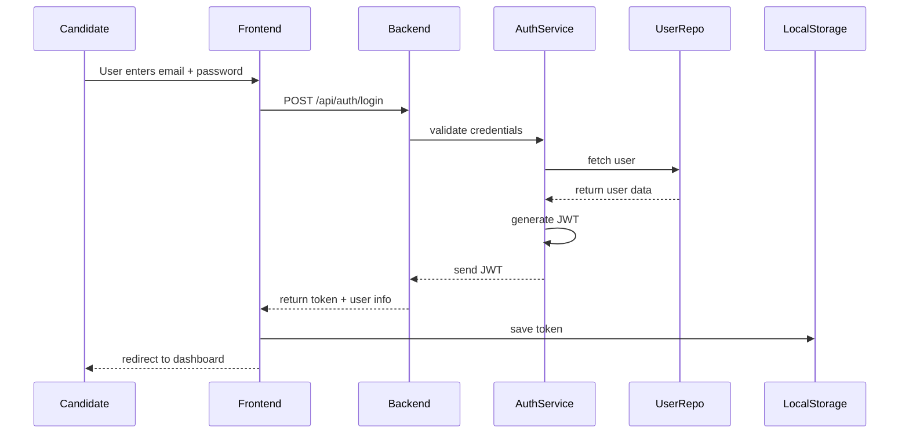

### 🚀 Job Portal – Full Stack Web Application

   A modern, full-stack job portal platform built with **Spring Boot (Java)** and **React + Vite**.  
   It allows **candidates** to browse and apply for jobs, **employers** to post and manage job listings, and **admins** to oversee the entire system.
    
------------------------------------------------------------------------------------------------------------
### ⭐ Features
  #### 👨‍🎓 Candidates
  
    Browse & filter jobs (location, type, experience, keywords)
    View job details with company info
    Apply with cover letter + resume upload
    Track application status
    Save jobs for later
    Manage profile

  #### 👨‍💼 Employers
    
    Create & manage job posts
    View applicants per job
    Update application status:
    Pending → Reviewed → Shortlisted → Accepted → Rejected
    Company profile management
    Email notifications to candidates

  #### 🛡️ Admins

    Manage users, companies, jobs, and applications
    View platform-wide statistics
    Complete system oversight
------------------------------------------------------------------------------------------------------------
### 🏗️ System Architecture

```mermaid
flowchart LR

    %% ======================= CLIENT ======================
    subgraph Client["🌐 Frontend (React + Vite)"]
        UI["User Interface"]
    end

    %% ======================= BACKEND ======================
    subgraph Server["⚙️ Backend (Spring Boot)"]
        AuthService["AuthService"]
        UserService["UserService"]
        JobService["JobService"]
        CompanyService["CompanyService"]
        ApplicationService["ApplicationService"]
        SavedJobService["SavedJobService"]
        NotificationService["NotificationService"]
        EmailService["EmailService"]
    end

    %% ======================= DATABASE ======================
    subgraph DB["🗄 PostgreSQL"]
        UserTable[(users)]
        CompanyTable[(companies)]
        JobTable[(jobs)]
        CandidateTable[(candidates)]
        EmployerTable[(employers)]
        ApplicationTable[(applications)]
        SavedJobTable[(saved_jobs)]
        NotificationTable[(notifications)]
        RoleTable[(roles)]
    end

    %% ======================= UI TO API =====================
    UI --> AuthService
    UI --> UserService
    UI --> JobService
    UI --> CompanyService
    UI --> ApplicationService
    UI --> SavedJobService
    UI --> NotificationService

    %% ======================= SERVICES TO DATABASE ==========
    AuthService --> UserTable
    AuthService --> RoleTable

    UserService --> UserTable
    UserService --> CandidateTable
    UserService --> EmployerTable

    CompanyService --> CompanyTable

    JobService --> JobTable
    JobService --> CompanyTable

    ApplicationService --> ApplicationTable
    ApplicationService --> UserTable
    ApplicationService --> JobTable

    SavedJobService --> SavedJobTable
    SavedJobTable --> UserTable
    SavedJobTable --> JobTable

    NotificationService --> NotificationTable
    NotificationService --> UserTable

    EmailService --> NotificationService
```

-------------------------------------------------------------------------------------------------
### 📊 Data Model (ER Diagram)

----------------------------------------------------------------------------------------------
### 🔐 Authentication Flow

------------------------------------------------------------------------------------------------
### ✅ Features

  -Job search with filters (location, type, experience)
  -Apply with resume + cover letter
  -Save jobs for later
  -User dashboard for candidates and employers
  -Role-based access: Admin / Employer / Candidate
  -Email notifications (on application submit/status change)
  
-------------------------------------------------------------------------------------------------
### ⚙️ Tech Stack

 #### Backend
  -Java 17
  -Spring Boot 3
  -Spring Security + JWT
  -Spring Data JPA (Hibernate)
  -PostgreSQL
  -Maven
  
 #### Frontend
  -React 18
  -Vite
  -Tailwind CSS
  -React Router
  -Axios
  
---------------------------------------------------------------------------------------------------
