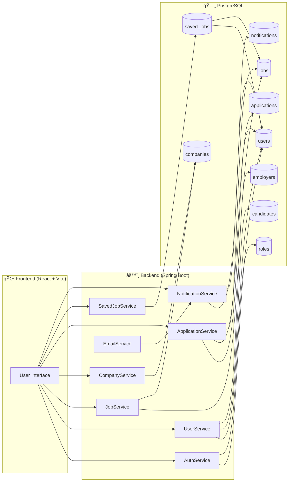
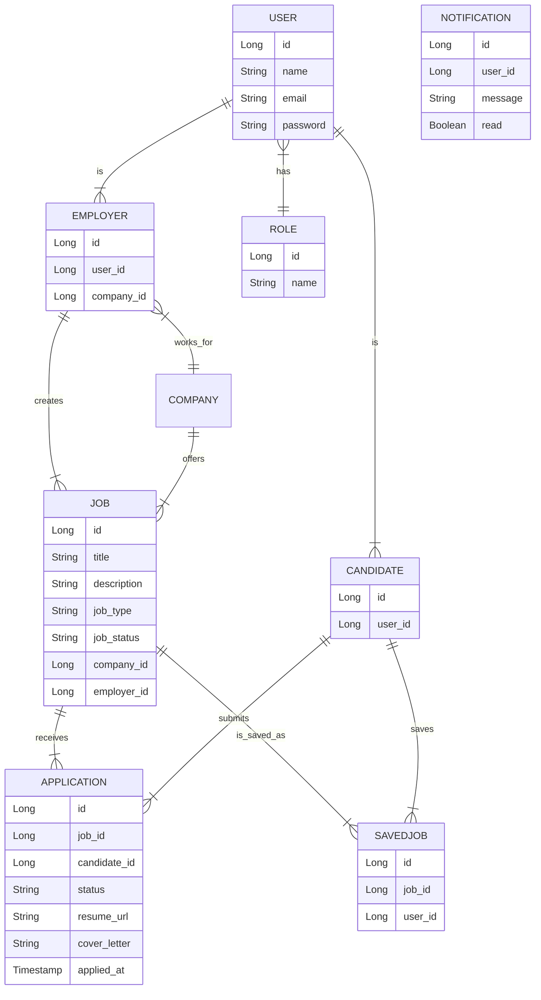
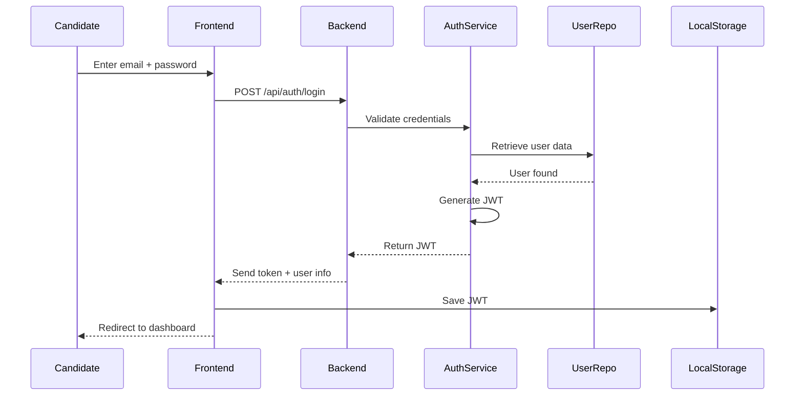

### 🚀 Job Portal – Full Stack Web Application

   A modern, full-stack job portal platform built with **Spring Boot (Java)** and **React + Vite**.  
   It allows **candidates** to browse and apply for jobs, **employers** to post and manage job listings, and **admins** to oversee the entire system.
    
------------------------------------------------------------------------------------------------------------
### ⭐ Features
  #### 👨‍🎓 Candidates
  
   - Browse & filter jobs (location, type, experience, keywords)
   - View job details with company info
   - Apply with cover letter + resume upload
   - Track application status
   - Save jobs for later
   - Manage profile

  #### 👨‍💼 Employers
    
   - Create & manage job posts
   - View applicants per job
   - Update application status:
   - Pending → Reviewed → Shortlisted → Accepted → Rejected
   - Company profile management
   - Email notifications to candidates

  #### 🛡️ Admins

   - Manage users, companies, jobs, and applications
   - View platform-wide statistics
   - Complete system oversight
------------------------------------------------------------------------------------------------------------
### 🏗️ System Architecture

-------------------------------------------------------------------------------------------------
### 📊 Data Model (ER Diagram)

----------------------------------------------------------------------------------------------
### 🔐 Authentication Flow

------------------------------------------------------------------------------------------------
### 📸 Screenshots

#### 🏠 Landing Page

#### 🏠 Registration Page

### 🛡️ Admin Panel

------------------------------------------------------------------------------------------------
### ✅ API Endpoints
#### Authentication (/api/auth)

- POST /api/auth/register → Register a new user
- POST /api/auth/login → Login & get JWT

#### Users (/api/users) 
#### (Authenticated user only)

- GET /api/users/profile → Get current user profile
- PUT /api/users/profile → Update current user profile
- PUT /api/users/change-password → Change password

#### Jobs (/api/jobs)

- GET /api/jobs → Get all jobs (pagination + sorting)
- GET /api/jobs/search → Search jobs (keyword, location, jobType, experience, company, pagination)
- GET /api/jobs/{id} → Get job details

#### (Employer only)

- POST /api/jobs → Create a job
- PUT /api/jobs/{id} → Update a job
- DELETE /api/jobs/{id} → Delete a job
- GET /api/jobs/my-jobs → Get employer's own posted jobs

#### Companies (/api/companies)

- GET /api/companies → Get all companies (paginated)
- GET /api/companies/{id} → Get company details

#### (Admin only)

- POST /api/companies → Create company
- PUT /api/companies/{id} → Update company
- DELETE /api/companies/{id} → Delete company

#### Applications (/api/applications)
#### (Candidate only)

- POST /api/applications → Apply for a job
- GET /api/applications/my-applications → Get candidate applications

#### (Employer only)

- GET /api/applications/job/{jobId} → Get all applications for a job
- PUT /api/applications/{id}/status?status=STATUS → Update application status
- (STATUS = PENDING / REVIEWED / SHORTLISTED / ACCEPTED / REJECTED)

#### (Candidate or Employer)

- GET /api/applications/{id} → View application by ID

--------------------------------------------------------------------------------------------------
### ✅ Features

- Job search with filters (location, type, experience)
-  Apply with resume + cover letter
-  Save jobs for later
-  User dashboard for candidates and employers
-  Role-based access: Admin / Employer / Candidate
-  Email notifications (on application submit/status change)
  
-------------------------------------------------------------------------------------------------
### ⚙️ Tech Stack

 #### Backend
- Java 17
- Spring Boot 3
- Spring Security + JWT
- Spring Data JPA (Hibernate)
- PostgreSQL
- Maven
  
 #### Frontend
- React 18
- Vite
- Tailwind CSS
- React Router
- Axios

---------------------------------------------------------------------------------------------------
