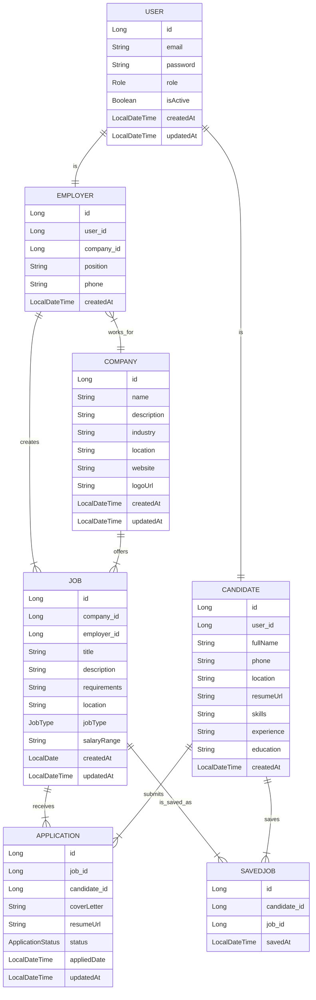
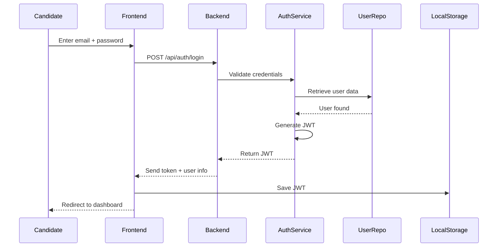

### 🧑‍💻 Job Portal – Full Stack Web Application
---

### 🚀 Project Overview
   A modern, full-stack job portal platform built with **Spring Boot (Java)** and **React + Vite**.  
   It allows **candidates** to browse and apply for jobs, **employers** to post and manage job listings, and **admins** to oversee the entire system.
    
------------------------------------------------------------------------------------------------------------
### ⭐ Features
  #### 👨‍🎓 Candidates
  
   - Browse & filter jobs (location, type, experience, keywords)
   - View job details with company info
   - Apply with cover letter + resume upload
   - Track application status
   - Save jobs for later
   - Manage profile

  #### 👨‍💼 Employers
    
   - Create & manage job posts
   - View applicants per job
   - Update application status:
   - Pending → Reviewed → Shortlisted → Accepted → Rejected
   - Company profile management
   - Email notifications to candidates

  #### 🛡️ Admins

   - Manage users, companies, jobs, and applications
   - View platform-wide statistics
   - Complete system oversight
------------------------------------------------------------------------------------------------------------
### 🏗️ System Architecture

```mermaid
flowchart LR

    %% ======================= CLIENT ======================
    subgraph Client["🌐 Frontend (React + Vite)"]
        UI["User Interface"]
    end

    %% ======================= BACKEND ======================
    subgraph Server["⚙️ Backend (Spring Boot)"]
        AuthService["AuthService"]
        UserService["UserService"]
        JobService["JobService"]
        CompanyService["CompanyService"]
        ApplicationService["ApplicationService"]
        SavedJobService["SavedJobService"]
        NotificationService["NotificationService"]
        EmailService["EmailService"]
    end

    %% ======================= DATABASE ======================
    subgraph DB["🗄 PostgreSQL"]
        UserTable[(users)]
        CompanyTable[(companies)]
        JobTable[(jobs)]
        CandidateTable[(candidates)]
        EmployerTable[(employers)]
        ApplicationTable[(applications)]
        SavedJobTable[(saved_jobs)]
        NotificationTable[(notifications)]
        RoleTable[(roles)]
    end

    %% ======================= UI TO API =====================
    UI --> AuthService
    UI --> UserService
    UI --> JobService
    UI --> CompanyService
    UI --> ApplicationService
    UI --> SavedJobService
    UI --> NotificationService

    %% ======================= SERVICES TO DATABASE ==========
    AuthService --> UserTable
    AuthService --> RoleTable

    UserService --> UserTable
    UserService --> CandidateTable
    UserService --> EmployerTable

    CompanyService --> CompanyTable

    JobService --> JobTable
    JobService --> CompanyTable

    ApplicationService --> ApplicationTable
    ApplicationService --> UserTable
    ApplicationService --> JobTable

    SavedJobService --> SavedJobTable
    SavedJobTable --> UserTable
    SavedJobTable --> JobTable

    NotificationService --> NotificationTable
    NotificationService --> UserTable

    EmailService --> NotificationService
```

-------------------------------------------------------------------------------------------------

## 📊 Data Model (ER Diagram)

----------------------------------------------------------------------------------------------
### 🔐 Authentication Flow

------------------------------------------------------------------------------------------------
### 📸 Screenshots

#### Landing Page

#### Registration Page

### Admin Panel

### Job Posting 

### Employer 

### Apply Job   

### Candidate 

------------------------------------------------------------------------------------------------
### ✅ API Endpoints

### Authentication (`/api/auth`)
- `POST /api/auth/register` – Register a new user
- `POST /api/auth/login` – Login & get JWT

### Users (`/api/users`)
- `GET /api/users/profile` – Get current user profile
- `PUT /api/users/profile` – Update current user profile
- `PUT /api/users/change-password` – Change password

### Jobs (`/api/jobs`)
- `GET /api/jobs` – Get all jobs (pagination + sorting)
- `GET /api/jobs/search` – Search jobs (keyword, location, jobType, experience, company, pagination)
- `GET /api/jobs/{id}` – Get job details
- `POST /api/jobs` – Create a job (Employer only)
- `PUT /api/jobs/{id}` – Update a job (Employer only)
- `DELETE /api/jobs/{id}` – Delete a job (Employer only)
- `GET /api/jobs/my-jobs` – Get employer's own posted jobs (Employer only)

### Companies (`/api/companies`)
- `GET /api/companies` – Get all companies (paginated)
- `GET /api/companies/{id}` – Get company details
- `POST /api/companies` – Create company (Admin only)
- `PUT /api/companies/{id}` – Update company (Admin only)
- `DELETE /api/companies/{id}` – Delete company (Admin only)

### Applications (`/api/applications`)
- `POST /api/applications` – Apply for a job (Candidate only)
- `GET /api/applications/my-applications` – Get candidate applications (Candidate only)
- `GET /api/applications/job/{jobId}` – Get all applications for a job (Employer only)
- `PUT /api/applications/{id}/status?status=STATUS` – Update application status (Employer only)
- `GET /api/applications/{id}` – View application by ID (Candidate or Employer)

  
-------------------------------------------------------------------------------------------------
### ⚙️ Tech Stack

 #### Backend
- Java 17
- Spring Boot 3
- Spring Security + JWT
- Spring Data JPA (Hibernate)
- PostgreSQL
- Maven
  
 #### Frontend
- React 18
- Vite
- Tailwind CSS
- React Router
- Axios

---------------------------------------------------------------------------------------------------
