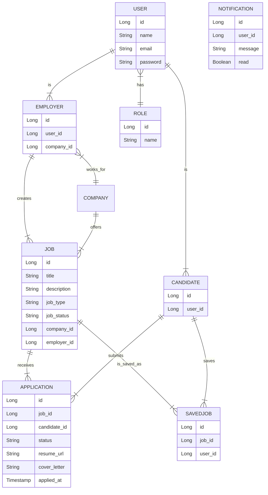
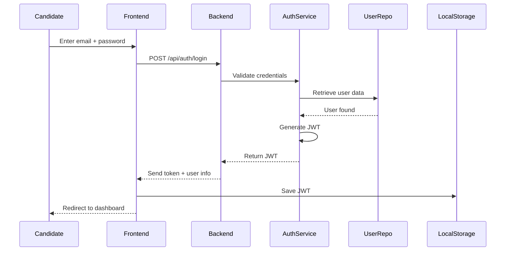

### 🧑‍💻 Job Portal – Full Stack Web Application
---

### 🚀 Project Overview
   A modern, full-stack job portal platform built with **Spring Boot (Java)** and **React + Vite**.  
   It allows **candidates** to browse and apply for jobs, **employers** to post and manage job listings, and **admins** to oversee the entire system.
    
------------------------------------------------------------------------------------------------------------
### ⭐ Features
  #### 👨‍🎓 Candidates
  
   - Browse & filter jobs (location, type, experience, keywords)
   - View job details with company info
   - Apply with cover letter + resume upload
   - Track application status
   - Save jobs for later
   - Manage profile

  #### 👨‍💼 Employers
    
   - Create & manage job posts
   - View applicants per job
   - Update application status:
   - Pending → Reviewed → Shortlisted → Accepted → Rejected
   - Company profile management
   - Email notifications to candidates

  #### 🛡️ Admins

   - Manage users, companies, jobs, and applications
   - View platform-wide statistics
   - Complete system oversight
------------------------------------------------------------------------------------------------------------
### 🏗️ System Architecture

```mermaid
flowchart LR

    %% ======================= CLIENT ======================
    subgraph Client["🌐 Frontend (React + Vite)"]
        UI["User Interface"]
    end

    %% ======================= BACKEND ======================
    subgraph Server["⚙️ Backend (Spring Boot)"]
        AuthService["AuthService"]
        UserService["UserService"]
        JobService["JobService"]
        CompanyService["CompanyService"]
        ApplicationService["ApplicationService"]
        SavedJobService["SavedJobService"]
        NotificationService["NotificationService"]
        EmailService["EmailService"]
    end

    %% ======================= DATABASE ======================
    subgraph DB["🗄 PostgreSQL"]
        UserTable[(users)]
        CompanyTable[(companies)]
        JobTable[(jobs)]
        CandidateTable[(candidates)]
        EmployerTable[(employers)]
        ApplicationTable[(applications)]
        SavedJobTable[(saved_jobs)]
        NotificationTable[(notifications)]
        RoleTable[(roles)]
    end

    %% ======================= UI TO API =====================
    UI --> AuthService
    UI --> UserService
    UI --> JobService
    UI --> CompanyService
    UI --> ApplicationService
    UI --> SavedJobService
    UI --> NotificationService

    %% ======================= SERVICES TO DATABASE ==========
    AuthService --> UserTable
    AuthService --> RoleTable

    UserService --> UserTable
    UserService --> CandidateTable
    UserService --> EmployerTable

    CompanyService --> CompanyTable

    JobService --> JobTable
    JobService --> CompanyTable

    ApplicationService --> ApplicationTable
    ApplicationService --> UserTable
    ApplicationService --> JobTable

    SavedJobService --> SavedJobTable
    SavedJobTable --> UserTable
    SavedJobTable --> JobTable

    NotificationService --> NotificationTable
    NotificationService --> UserTable

    EmailService --> NotificationService
```

-------------------------------------------------------------------------------------------------
### 📊 Data Model (ER Diagram)

----------------------------------------------------------------------------------------------
### 🔐 Authentication Flow

------------------------------------------------------------------------------------------------
### 📸 Screenshots

#### Landing Page

#### Registration Page

### Admin Panel

### Job Posting 

### Employer 

### Apply Job   

### Candidate 

------------------------------------------------------------------------------------------------
### ✅ API Endpoints
#### Authentication (/api/auth)

- POST /api/auth/register → Register a new user
- POST /api/auth/login → Login & get JWT

#### Users (/api/users) 
#### (Authenticated user only)

- GET /api/users/profile → Get current user profile
- PUT /api/users/profile → Update current user profile
- PUT /api/users/change-password → Change password

#### Jobs (/api/jobs)

- GET /api/jobs → Get all jobs (pagination + sorting)
- GET /api/jobs/search → Search jobs (keyword, location, jobType, experience, company, pagination)
- GET /api/jobs/{id} → Get job details

#### (Employer only)

- POST /api/jobs → Create a job
- PUT /api/jobs/{id} → Update a job
- DELETE /api/jobs/{id} → Delete a job
- GET /api/jobs/my-jobs → Get employer's own posted jobs

#### Companies (/api/companies)

- GET /api/companies → Get all companies (paginated)
- GET /api/companies/{id} → Get company details

#### (Admin only)

- POST /api/companies → Create company
- PUT /api/companies/{id} → Update company
- DELETE /api/companies/{id} → Delete company

#### Applications (/api/applications)
#### (Candidate only)

- POST /api/applications → Apply for a job
- GET /api/applications/my-applications → Get candidate applications

#### (Employer only)

- GET /api/applications/job/{jobId} → Get all applications for a job
- PUT /api/applications/{id}/status?status=STATUS → Update application status
- (STATUS = PENDING / REVIEWED / SHORTLISTED / ACCEPTED / REJECTED)

#### (Candidate or Employer)

- GET /api/applications/{id} → View application by ID

--------------------------------------------------------------------------------------------------
### ✅ Features

- Job search with filters (location, type, experience)
-  Apply with resume + cover letter
-  Save jobs for later
-  User dashboard for candidates and employers
-  Role-based access: Admin / Employer / Candidate
-  Email notifications (on application submit/status change)
  
-------------------------------------------------------------------------------------------------
### ⚙️ Tech Stack

 #### Backend
- Java 17
- Spring Boot 3
- Spring Security + JWT
- Spring Data JPA (Hibernate)
- PostgreSQL
- Maven
  
 #### Frontend
- React 18
- Vite
- Tailwind CSS
- React Router
- Axios

---------------------------------------------------------------------------------------------------
